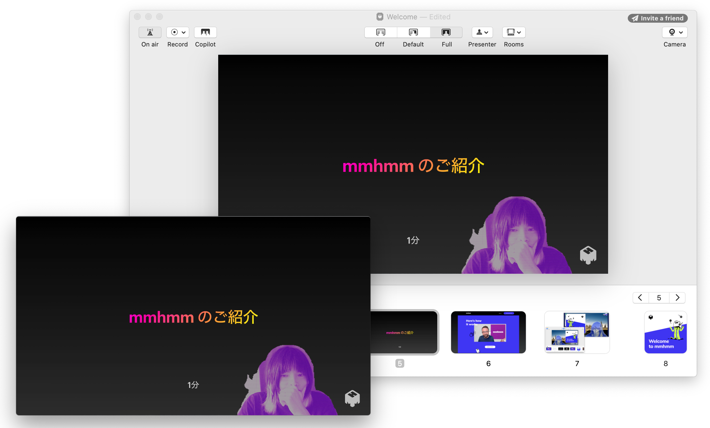
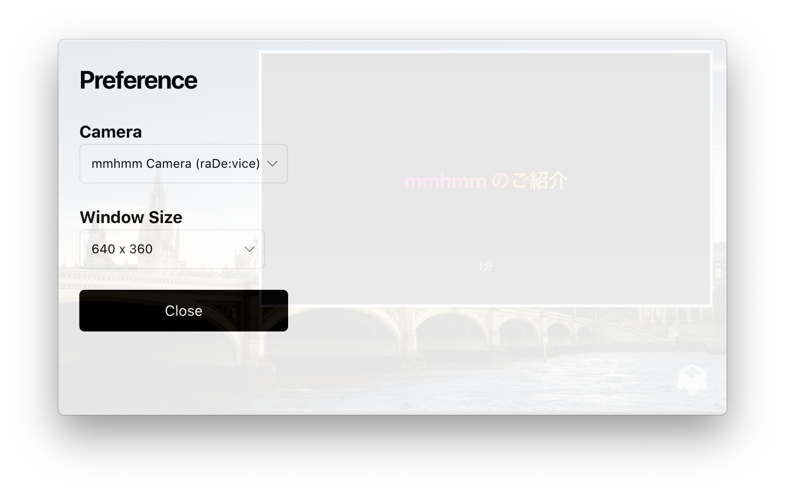
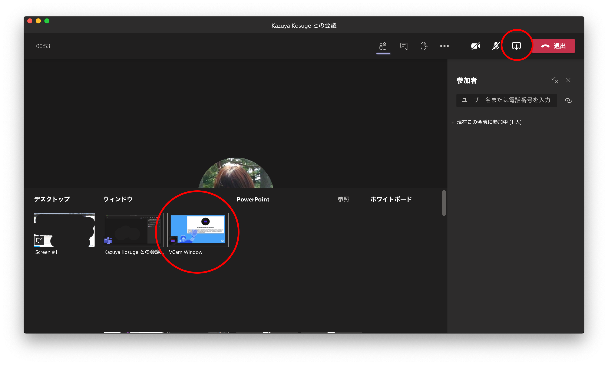

  

  <h1>VCam Window for mmhmm</h1>

I want to use [mmhmm](https://www.mmhmm.app/) streaming input as a presenter in a video conferencing tool (e.g. Microsoft Teams), but I can't use the presentation mode because it is a just virtual camera input. To solve this problem, we need to output the webcam video as an application screen share rather than as a webcam input. This application can display virtual or physical camera video in a frameless window.

## Download

### macOS

You can <b>[download](https://github.com/kkosuge/vcam-window/releases/latest)</b> installable version of VCam Window.

### Windows or Linux

I don't have a release version of the build available at this time. However, you may be able to get it working if you clone the repository and `yarn install && yarn run make`.

## Screenshots

## License

[MIT](https://opensource.org/licenses/MIT) Copyright (c) 2020-present [@kkosuge](https://kksg.net)
